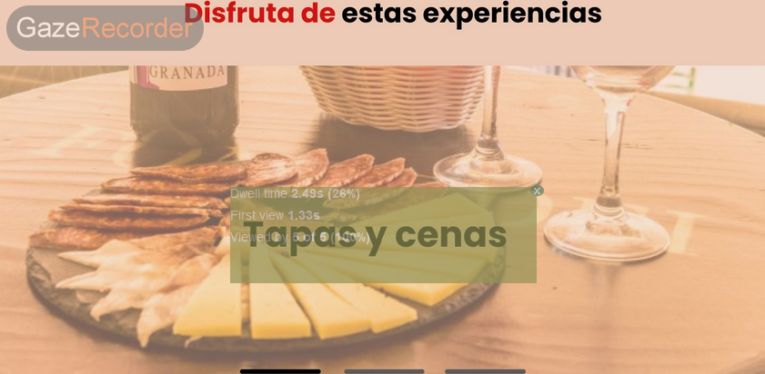

_## Practica 5: EYE TRACKING 

### Diseño del experimento y reclutado de usuarios
Como complemento para evaluar la usabilidad de la web vista en la sección 4, vamos a realizar un estudio de las secciones sobre las que los usuarios dirigen su atención, obteniendo los puntos de interés (AOI) del web.
Para ello haremos uso de GAZE Recorder, una herramienta que gracias a la webcam del ordenador, calibra la mirada y puede analizar las secciones a las que el usuario mira.

Para realizar el experimento hemos dividido la página principal en 4 imágenes diferentes ya que era demasiado larga para mostrarla en una sola. Al ser tan extensa no se podían leer bien los textos. Cada imagen del site map es mostrada durante 10 segundos.

Para los usuarios hemos recabado una muestra de 5 personas. Ambos miembros del equipo también han participado para dotar de una visión experta con la que comparar el resto de usuarios.

Usuarios expertos:
- Gador Romero
- Victor Pérez

Usuarios objetivo (compañeros del subgrupo):
- María Párraga
- Sergio Muñóz
- Jesús Palomares

### Informe y Conclusiones
La aplicación proporciona un mapa de calor(heatmap), con los puntos que los usuarios han retenido su mirada y las Áreas de interés de los usuarios.

#### HeatMaps

#### Análisis Áreas de Interés

Después de analizar las áreas de interés hemos visto que algunas zonas del menú pasan desapercibidas. Son las categorías más a la derecha por lo que pensamos que los usuarios al ver las primeras opciones ya saben que el menú esta situado en esa posición y no analizan el resto de opciones. Otra zona desapercibida es en la última imagen la zona de contacta con nosotros. Toda la atención se centra en el botón de enviar pero los usuarios no miran de que es el formulario.

###Conclusiones
Las áreas de interés se muestran muy claramente y consiguen la atención que se pretendía. De forma general el diseño de la página cumple con su cometido.
