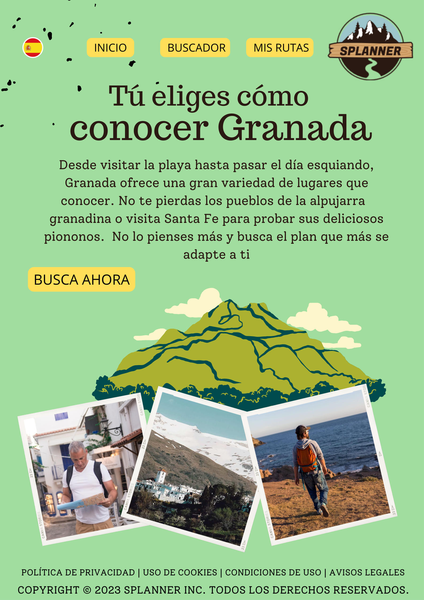

# DIU23
Prácticas Diseño Interfaces de Usuario 2022-23 (Tema: .... ) 

Grupo: DIU2._07_Dumbledore.  Curso: 2022/23 
Updated: 11/1/2023

Miembros
 Gador Romero Prieto   
 Victor Perez Barranco

Proyecto: 
>>> Nombre de nuestro proyecto: SPlanner

Descripción: 

>>> Es una web donde los propios usuarios pueden crear y añadir rutas para que otros usuarios las hagan. Además cada ruta puede tener variantes. Estas variantes tienen una estructura similiar a la ruta original pero con alguna otra parada. Se pueden buscar rutas a través de la ubicación o a través del inicio y el fin. 

Logotipo: 
>>> 

----- 

# Proceso de Diseño 

## Paso 1. UX Desk Research & Analisis 

 1.a Competitive Analysis
-----

>>> Conclusión del Competitive Analysis:
>>>Analizamos 3 webs diferentes relacionadas con el turismo. Una pagina de tablaos flamencos https://alboreaflamenco.com/, una página de free tours https://freetour-granada.com/ y una página de un taller de artesanía https://artesanianazari.es/ 
>>> Nos centramos en la página de free tours para los siguientes apartados
>>>

 1.b Persona
-----
>>>Creamos dos personas que podrían ser usuarios de la página de FreeTour.
>>>Con la  nos queríamos enfocar en el turista extranjero, un tipo de usuario potencial para este tipo de páginas.
>>>
>>>Con la  nos enfocamos en personas que no están muy habituadas con el uso del ordenador debido a la edad y al entorno en el que viven.

 1.c User Journey Map
---- 
>>> Ambas experiencias de usuario tienen problemas. Por un lado el turista al no entender el idioma tiene problemas en el proceso de reserva y necesita ayuda externa. Por otro lado Gerardo no tiene muy claro que tiene que hacer en la página ya que no viene claramente indicado.

>>>
>>>
>>>

 1.d Usability Review
----
>>>  La revisión se puede encontrar en el siguiente  
>>>> 
>>> Tras haber realizado la revisión hemos obtenido una valoración de 68 (moderada) esto es debido a que se pueden realizar las acciones requeridas y la información proporcionada es suficiente pero presente serios problemas. 
>>> Las principales deficiencias que vemos son:
>>> Uso de aplicación externa de Reserva 
>>> Falta de ayuda al usuario
>>> El menú no se muestra con claridad

 1.e Empathy Map
----
En esta parte hemos comentado los principales errores que hemos encontrado en la página al contar nuestra experiencia.Con ayuda de nuestras personas hemos podido abstraer las principales preocupaciones de los posibles usuarios (apartado user needs) y como se pueden resolver (apartado insights). 

## Paso 2. UX Design  

 2.a Feedback Capture Grid / EMpathy map / POV
----
>>>Hemos recogido tanto nuestras experiencias como las de Mark y Gerardo en la siguiente Malla de información receptora.
>>>
>>>

>>> Teniendo en cuenta estas experiencias hemos creado nuestra propuesta para fomentar el turismo en Granada: Splanner. 

>>>Splanner es una web para compartir con otros usuarios rutas en la provincia Granadina. Los usuarios pueden crear sus propias experiencias o realizar las ya publicadas y posteriormente dejar una reseña. Si una ruta no se adapta completamente a un usuario puede variarla añadiendo o quitando paradas para adaptarla. Tras realizarla puede decidir si publicarla como variante o no. Además existen una serie de filtros para buscar la ruta deseada, gastronómico, senderismo, cultural o familiar. Tiene dos modos de búsqueda, el principal donde el usuario introduce su ubicación o un lugar donde quiera conocer rutas cercanas y se le muestran ordenadas por mejores valoraciones y el modo personalizado. En este modo el usuario introduce el inicio y el fin de la ruta que desea realizar y se le muestran las posibilidades que coinciden ordenadas también por mejores valoraciones. Si no ha introducido ubicación se le muestran las mejores urtas.

 2.b ScopeCanvas
----
>>> Propuesta de valor 
>>> En esta propuesto hemos resumido las ideas sobre las que nos hemos basado para crear nuestro proyecto. Las principales acciones que puede realizar el usuario están presentes así como nuestros objetivos y propósitos.
>>> 
>>> 

 2.c Tasks analysis 
-----
>>> Hemos analizado las posibles interacciones de los distintos usuarios en nuestra página para saber qué acciones son más importantes y por tanto enfocarnos más en ellas.
>>> 
>>> 

 2.c IA: Sitemap + Labelling 
----
>>>En la siguiente imagen se muestra la estructura de nuestra página.
>>>

>>>Ya en el labelling hemos explicado la funcionalidad de cada página introducida en el SiteMap
>>>  

 2.d Wireframes
-----

>>> En este apartado hemos realizado los bocetos de cada página de nuestro proyecto dando una primera idea básica de la estructura de cada una.

>>>Página de identificación
>>>

>>>Página de inicio
>>>

>>>Buscador Principal
>>>

>>>Buscador Personalizado
>>>

>>>Mis rutas
>>>

>>>Mi cuenta
>>>

## Paso 3. Mi UX-Case Study (diseño)

 3.a Moodboard
-----

>>> Es un Diseño Visual donde definimos una guía de estilos visuales. Definimos el proyecto y el branding, seleccionando logotipo y mensajes de apoyo. Imágenes y webs de inspiración. Paleta de colores, tipografía e imágenes e iconos.
>>> Son los primeros pasos sobre el diseño de la web, buscamos obtener la identidad y personalidad que deseamos que tenga la marca.
>>> Hemos elegido unos colores llamativos para causar impresión. Al mismo tiempo son relajantes para transportar al usuario a la naturaleza y a lo rural con el contraste verde-marrón.
>>> 
>>>

>>>
>>>
>>>Con nuestro logotipo queremos dar una impresión de aventura en el mundo rural debido a que nuestras rutas son experiencias para descubrir nuevos sitios. 
>>> Nuestro logotipo tambíen cuenta con un eslogan: Tú eliges cómo conocer Granada. Queremos trasmitir que nuestra experiencia se adapta a cada uno de los usuarios.
>>> El logotipo ha sido diseñado con canva y tenemos varios modelos. Con y sin eslogan para ser utilizados en distintos sitios. Por ejemplo el glogo sin eslogan está presente en la Landing Page

  3.b Landing Page
----

>>> El Landing Page es un tipo de página promocional, parecida a un boceto, que presenta ya el estilo seleccionado para la web e incluye elemento como Título, elementos gráficos y beneficios de la web.
>>> Uno de nuestros colores principales es el verde y lo hemos escogido como fondo del landing Page para llamar la atención a los usuarios
>>>

 3.c Guidelines
----
>>> Para realizar el layout hemos utilizado seguido dos guidelines.
>>> 
>>> El  para la elección de como representar los distintos idiomas de la página. Este aspecto es fundamental para una página relacionada con el turismo. Queremos que se represente de forma clara y sencilla.
>>> 
>>> El  para el diseño del menú principal. Queremos que el usuario se mueva por la página con facilidad y tenga claro en todo momento como llegar a su opción deseada.

  3.d Mockup
----
>>> Consiste en acercar nuestro bocetos LOFI creados en la P3 a el diseño web final que tendría el producto. Permite visualizarlo y hacernos una idea muy fiel a la que sería la final de la interfaz y experiencia que tendría el usuario con nuestra web.

Los hemos diseñado con ayuda de figma y se puede ver tanto en nuestro .fig) como en nuestro archivo en  donde se puede simular la interacción con la página

 3.e ¿My UX-Case Study?
-----
>>> En este apartado hemos querido mostrar la interacción del usuario en nuestra web. Para ello hemos grabado un vídeo que se puede encontrar  (es necesaria la descarga para su visualizacion)

## Paso 4. Evaluación 

 4.a Caso asignado
>>> Se nos ha asignado el caso de uso del equipo Chocobom. Su página web llamada la Alborea consiste en un webSite para la reserva de espectáculos de flamenco en Granada. Además de poder realizar la reserva también puedes ver opiniones, imágenes y conocer las distintas experiencias que brindan los espectáculos.

>>> Su enlace de github es el 

 4.b User Testing
----

>>> Nuestra muestra está formada por seis personas y todas realizan tanto el test A como el test B.
 
>>>User 1: Marta Garcia. Mujer 36 años. Profesora de Primaria. Experiencia Básica en Tics.
>>>Al ser profesora está trabajando en un lugar alejado de su familia y por ello se siente sola en la ciudad. Su familia viene a Granada a verla y decide probar >>>nuevas ofertas por la provincia.

>>>User 2: Carlos Sainz. Hombre de 42 años. Organizador de eventos. Experiencia Media.
Quiere buscar nuevas experiencias para sus eventos. Se siente indiferente frente al flamenco pero cree que puede ser una oferta interesante para turistas.

>>>User 3: Pepe Martí. Hombre de 30 años. Ingeniero Informático. Experiencia Alta en Tics.
>>>Quiere sorprender a su pareja con una velada de flamenco y gastronomía andaluza. Está ilusionado buscándolo.

>>>User 4: Belén Rodríguez. Mujer de 56 años. Azafata. Experiencia Media en Tics.
>>>Al ser azafata tiene dos días libres en Granada y organiza con sus compañeros una vista a un tablao flamenco. Tiene miedo de que no le guste la experiencia al >>>ser de México.

>>>User 5: Ramón Sánchez (Real). Hombre de 21 años. Estudiante. Experiencia avanzada en Tics. Está estudiando en Granada y decide buscar una actividad nueva para >>>hacer con sus amigos. Está cansado ya que ha dormido poco por los exámenes.

>>>User 6: Belén Adarve (Real). Es una escritora nómada que inspira sus historias de variadas épocas cuyo argumento involucra acciones y actividades de la cultura asentada en España. Busca inspiración en diferentes actividades típicas de las regiones. 

. 4.c Cuestionario SUS
----

>>> Usaremos el **Cuestionario SUS** para valorar la satisfacción de cada usuario con el diseño (A/B) realizado. En este  se pueden ver los resultados de cada una de las personas y su puntuación final.
>>> 
>>>Para más información, consultar aquí sobre la [metodología SUS](https://cui.unige.ch/isi/icle-wiki/_media/ipm:test-suschapt.pdf)

>>> Adjuntar captura de imagen con los resultados + Valoración personal 
>>> 
>>> Captura de cuestionario SUS para el test B
>>> 

 4.d Usability Report
----

>> Añadir report de usabilidad para práctica B (la de los compañeros)
>>>  

>>> Valoración personal 

>>> ## Paso 5. Evaluación de Accesibilidad  (no necesaria)

>>>   5.a Accesibility evaluation Report 
>>>> ----

>>> Indica qué pretendes evaluar (de accesibilidad) sobre qué APP y qué resultados has obtenido 

>>> 5.a) Evaluación de la Accesibilidad (con simuladores o verificación de WACG) 
>>> 5.b) Uso de simuladores de accesibilidad 

>>> (uso de tabla de datos, indicar herramientas usadas) 

>>> 5.c Breve resumen del estudio de accesibilidad (de práctica 1) y puntos fuertes y de mejora de los criterios de accesibilidad de tu diseño propuesto en Práctica 4.

## Conclusión final / Valoración de las prácticas

>>> (90-150 palabras) Opinión del proceso de desarrollo de diseño siguiendo metodología UX y valoración (positiva /negativa) de los resultados obtenidos  

